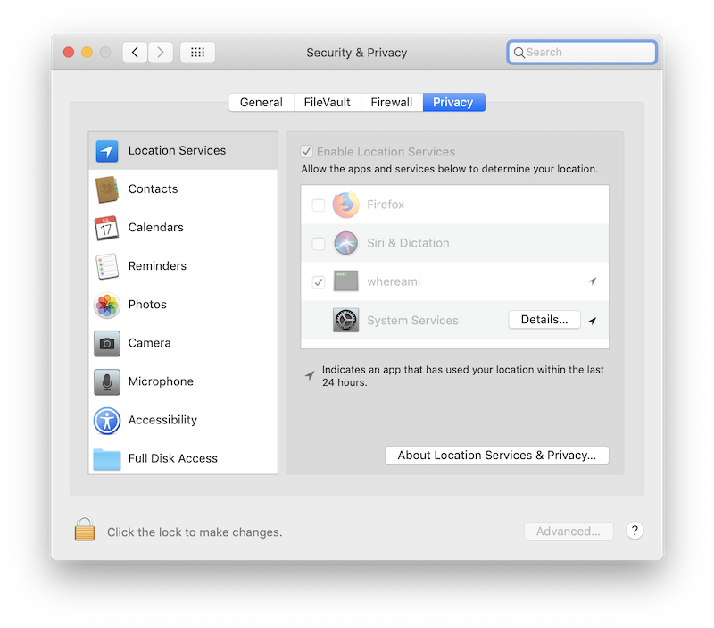
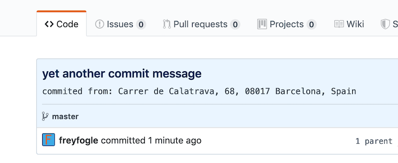

# add your location to your git commits

If you're on Mac OSX you can use Rob Mather's [WhereAmI](https://github.com/robmathers/WhereAmI) utility to get the location your computer thinks it is at.


You will need

1. Download and install [WhereAmI](https://github.com/robmathers/WhereAmI)
Put it in your home directory as `whereami`

2. Register for an [OpenCage Geocoder](https://opencagedata.com/) API key

3. Test that WhereAmI is working

```
$~/whereami 
Latitude: 41.401499
Longitude: 2.128773
Accuracy (m): 65.000000
Timestamp: 17/10/2019, 13:26:32 CEST
```

You will probably need to go into **System Preferences > Security & Privacy > Privacy** and enable **Location Services** to get it to work. 




4. now add you OpenCage API key with the optional `-k` flag

```
$~/whereami -k abcdefghijklmnopqrstuvxyz1234567
Latitude: 41.401499
Longitude: 2.128773
Accuracy (m): 65.000000
Timestamp: 17/10/2019, 13:27:28 CEST
Carrer de Calatrava, 68, 08017 Barcelona, Spain
```

Note that the location is now printed as the fifth line of output, as the
coordinates have been geocoded by OpenCage. You will of course need to be
connected to the interent.

5. copy the file [prepare-commit-msg](prepare-commit-msg) into `~/PROJECT/.git/hooks` and set it to be exectuable

The next time you commit in PROJECT the location should now be appended to the commit message. 




